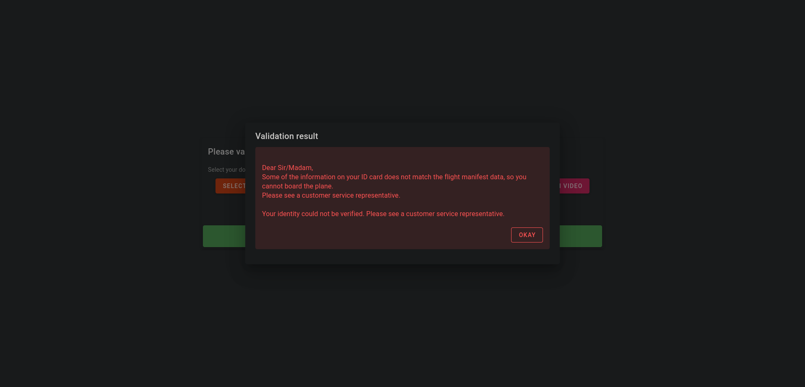
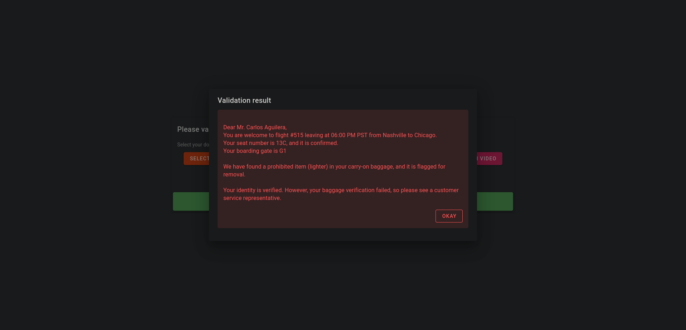

### Project: Automated Passenger Boarding Kiosk
This is my submission for the Udacity's AI Engineer using Microsoft Azure Nanodegree Program first project, an automated passenger boarding kiosk validator, which will present a complete validation flow for passengers about to board their plane at the airport.

The idea is simple, at the airport, a passenger must validate all his information before proceeding to board his plane. The documents required for this are

- Boarding pass: document containing the passenger's flight-related information such as seat number, boarding date, origin, destination, etc.
- ID card: identity document with information such as passenger's name, date of birth, facial photo, etc. 
- Verification video: a short video of the passenger simulating the boarding and validation process at the kiosk. 
- Baggage image: an image that simulates the baggage verification process that usually takes place at airport check-in.

In addition to these documents, there is a manifest table pre-filled with passenger data and flight information, which will be used to verify identity and flight data to validate boarding.

The main idea is to automate the boarding process at an airport without any human intervention by using the capabilities of different AI services and trying to make it as seamless as possible.

For this I created a Flask application serving as the backend API of the solution and a Vue frontend using Vuetify, which will consume the API.

The kiosk website can be accessed at https://azureaiblob.z13.web.core.windows.net/

To perform a validation you must upload 4 files, the boarding pass file (either image or pdf format), the identification document image file, the verification video file and a carry-on luggage image file. To perform a simple test validation only the boarding pass and id document are required, however, validation for identity and luggage will not succeed.

In this example I will validate my boarding using the documents I generated for my data.

First I choose my boarding pass document, I will use the image format for demonstration purposes, however, pdf format is supported too.

Then I select my id document image file

After that I select my verification video

Finally I select an example carry-on luggage image file

These four files will the be uploaded to the Flask API application, which is running on Azure App Service. This process can take quite some time depending on the size of the verification video and connection speed.

After the video is uploaded and analyzed by Azure Video Indexer, the validation process begins.

When validation is over, a validation message shows on screen with the validation results.

For this demo, as I used the correct documents to validate my boarding, and the luggage image file does not contain any lighter, the validations succeeds.
But different validation messages can be displayed, depending on the data submitted

When id document does not match with data from the flight manifest

When boarding pass data does not match with data from the flight manifest

When boarding pass, id document and luggage are valid, but video verification couldn't be validated

When boarding pass and id document and luggage are valid, but luggage and video validation fail

When boarding pass, id document and video  are valid, but luggage validation fails

