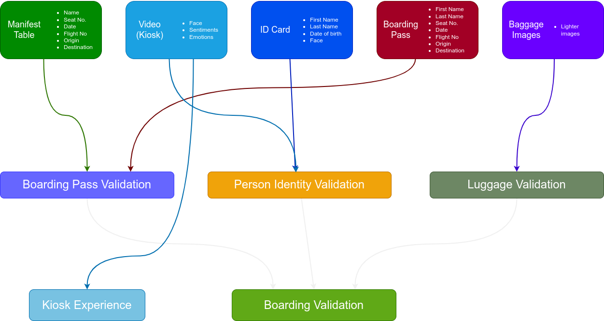

### Step 1: Problem Definition & System Design

#### :ballot_box_with_check: A PDF document explaining problem definition and your solution strategy
##### Problem Definition and solution strategy write-up
In this project we are building an automated passenger boarding kiosk.

The idea is simple, at the airport, a passenger must validate all his information before proceeding to board his plane. The documents required for this are

- Boarding pass: document containing the passenger's flight-related information such as seat number, boarding date, origin, destination, etc.
- ID card: identity document with information such as passenger's name, date of birth, facial photo, etc. 
- Verification video: a short video of the passenger simulating the boarding and validation process at the kiosk. 
- Baggage image: an image that simulates the baggage verification process that usually takes place at airport check-in.

In addition to these documents, there is a manifest table pre-filled with passenger data and flight information, which will be used to verify identity and flight data to validate boarding.

The main idea is to automate the boarding process at an airport without any human intervention by using the capabilities of different AI services and trying to make it as seamless as possible.

The entire validation process involves the use of multiple AI services and their combination to obtain a final result: whether the passenger can board the plane or not. For this, multiple conditions must be met, as described below.

Prior to the boarding validation process, a passenger manifest (list of passengers boarding the plane) is created with a list of 5 or more passengers with information such as their names, date of birth, flight number, origin, destination, etc. This information will be used to validate the documents presented by the passenger during the validation process, as mentioned above.

Three main validations are required for the entire validation process to be successful, **Personal Identity Validation**, which validates the passenger's identity, **Boarding Pass Validation**, which validates the boarding information according to the passenger's manifest, and **Luggage Validation**, which validates whether the passenger's carry-on items contain any prohibited items or not.

Using the **Azure Form Recognizer** service, a model will be trained to extract passenger information from boarding passes, this information will be used to perform **Boarding Pass Validation**.

For **Personal Identity Validation**, **Azure Form Recognition** digital ID service will be used to extract the face and personal information from passengers' digital ID document, and then **Azure Video Indexer** service will be used to extract the face photo from the verification video. The photo extracted from the video will be compared with the photo extracted from the ID using the **Azure Face API**, and the information extracted from the digital ID will be compared with that from the passenger manifest.

Finally, for the **Luggage Validation** process, the **Azure Custom Vision** service will be used to detect the presence of lighters in images of carry-on luggage by simulating the check-in process at an airport. For this, a Custom Vision model has been previously trained using multiple images of lighters.

Once the boarding pass validation has been performed, the final message of successful or unsuccessful validation will be displayed as part of the last step of this project.

#### :ballot_box_with_check: A PDF document (or JPG/PNG) showing data flow diagram

#### :ballot_box_with_check: A PDF document  (or JPG/PNG) showing architecture diagram
