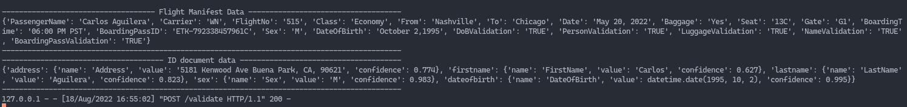
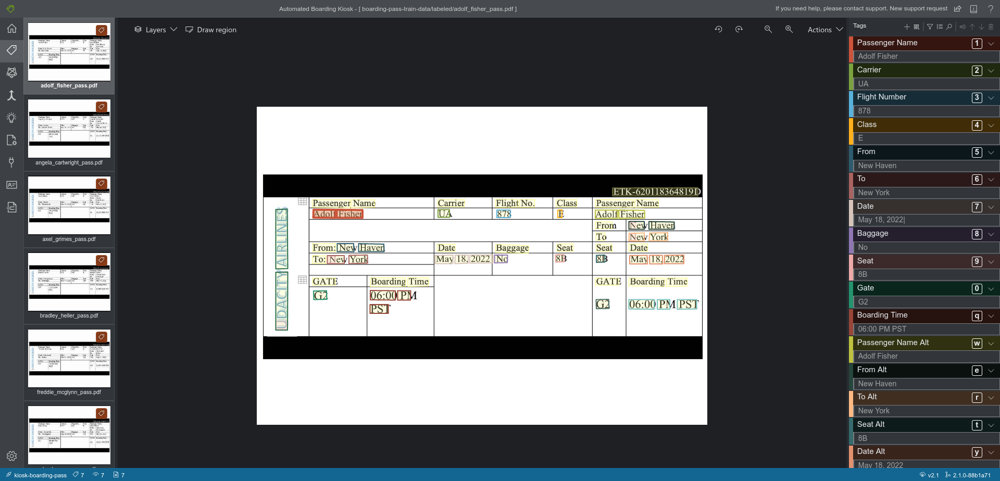
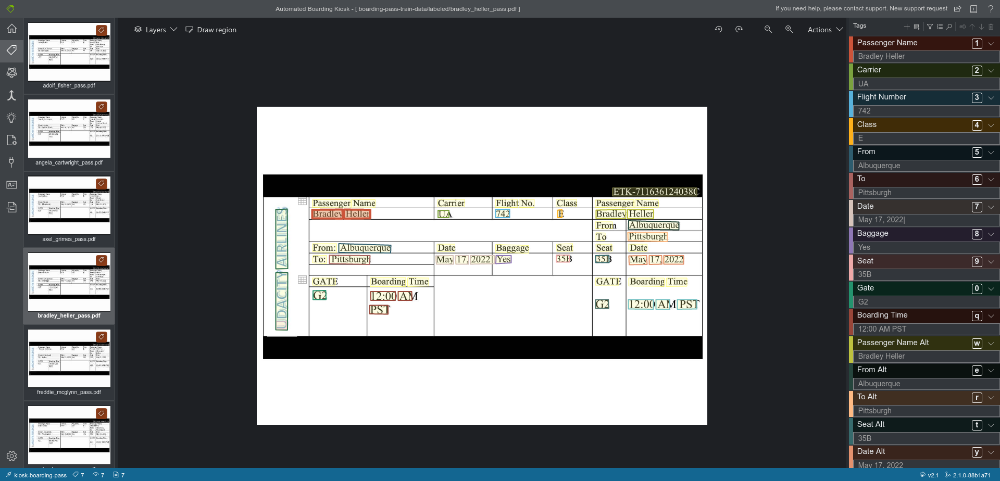
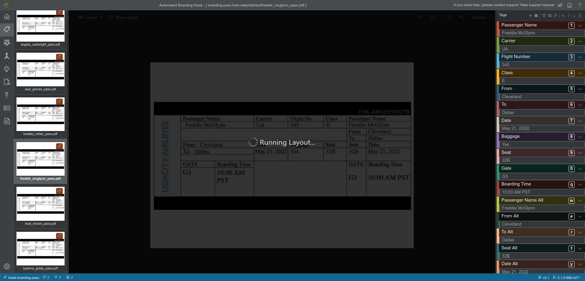
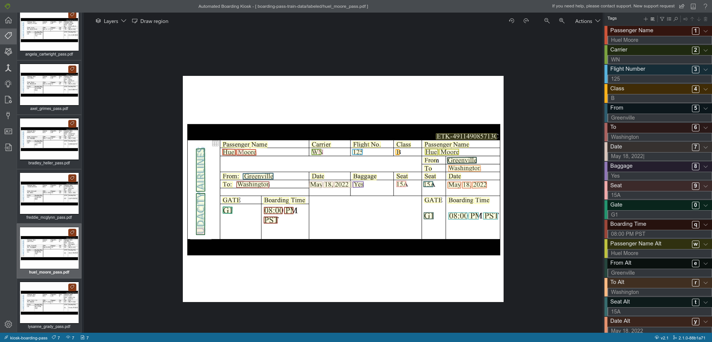
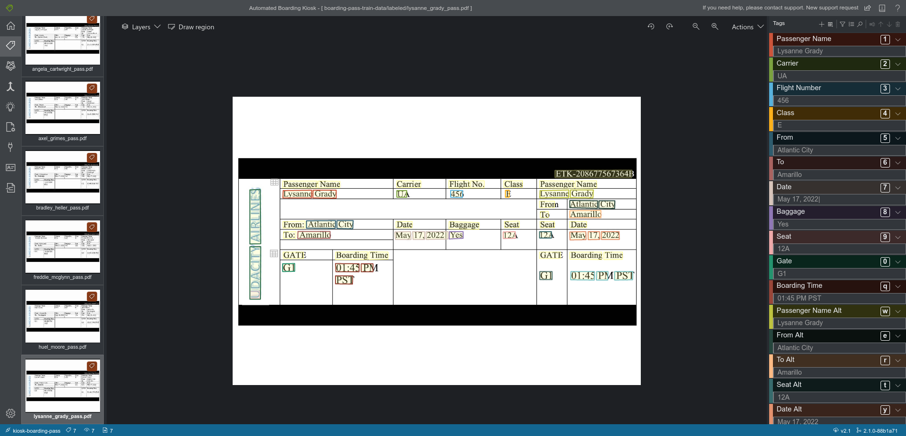
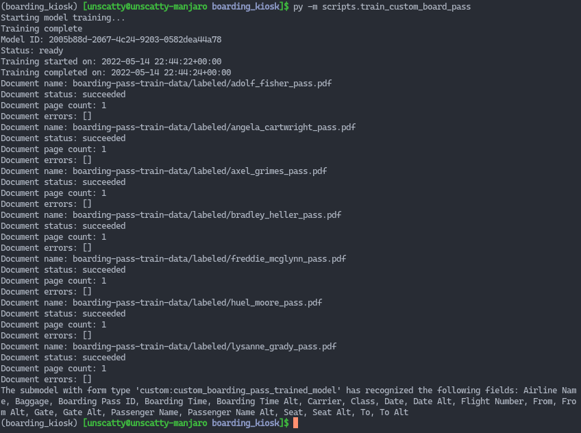
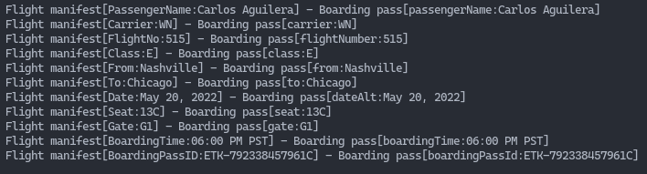
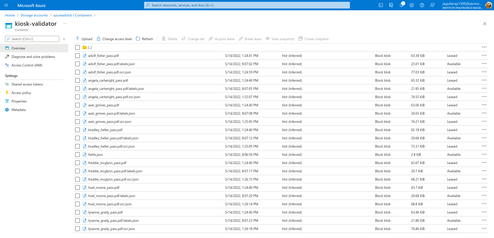

### Step 2: Text Data Extraction

#### :ballot_box_with_check: Python code snippet (either in text format or a screenshot) showing Form Recognizer ID's API is used to extract information from the digital ID
For this I created two methods, one to extract data from a provided URL and the other to extract data from a file (to be used with a `POST` request)

File: `services/form_recognizer.py` at line `15`

```python
def extract_from_identity(self, identity_url: str, schema=IDENTITY_SCHEMA) -> list:
    # Extract al information from the document url
    id_content_from_url = self.form_recognizer_client.begin_recognize_identity_documents_from_url(
        identity_url)

    id_content = id_content_from_url.result()

    # Transform it into a dict
    return [recognized_form_to_dict(result.fields, schema) for result in id_content]

def extract_from_identity_file(self, indentity_file, schema=IDENTITY_SCHEMA) -> list:
    # Extract al information from the document file
    id_content_from_file = self.form_recognizer_client.begin_recognize_identity_documents(
        indentity_file)

    id_content = id_content_from_file.result()

    # Transform it into a dict
    return [recognized_form_to_dict(result.fields, schema) for result in id_content]
```

#### :ballot_box_with_check: Screenshot proving the extracted data from digital ID does match with the information on the ID




#### :ballot_box_with_check: Screenshot showing boarding passes are used to generate labels using label layout generation website and both boarding pass and label contents are uploaded to Azure Blob Storage









#### :ballot_box_with_check: Python code snippet (either in text format or a screenshot) showing you training the custom boarding pass recognition model
For this I created a python script (`scripts/train_custom_board_pass.py`) to train the model using the documents and their corresponding generated labels

Data like the custom model name, the model id, and the Azure Blob Storage url with the documents and labels is taken from enviroment variables

The script is run executing `python -m scripts.train_custom_board_pass` from the project's root folder

File: `scripts/train_custom_board_pass.py`

```python
from env import ENV
from azure.core.credentials import AzureKeyCredential
from azure.ai.formrecognizer import FormTrainingClient

__form_recognizer_config = ENV.azure.form_recognizer

__endpoint = __form_recognizer_config.endpoint
__key = __form_recognizer_config.key

custom_model_name = __form_recognizer_config.training.model_name
custom_model_training_data_url = __form_recognizer_config.training.training_data.url
custom_model_training_data_subfolder = __form_recognizer_config.training.training_data.subfolder

form_training_client = FormTrainingClient(
    endpoint=__endpoint, credential=AzureKeyCredential(__key))

print('Starting model training...')

training_process = form_training_client.begin_training(
    custom_model_training_data_url, use_training_labels=True, prefix=custom_model_training_data_subfolder, model_name=custom_model_name)

custom_model = training_process.result()

print('Training complete')

# Info about custom model
custom_model_info = form_training_client.get_custom_model(
    model_id=custom_model.model_id)
print("Model ID: {}".format(custom_model_info.model_id))
print("Status: {}".format(custom_model_info.status))
print("Training started on: {}".format(custom_model_info.training_started_on))
print("Training completed on: {}".format(
    custom_model_info.training_completed_on))

# List training documents details
for doc in custom_model.training_documents:
    print("Document name: {}".format(doc.name))
    print("Document status: {}".format(doc.status))
    print("Document page count: {}".format(doc.page_count))
    print("Document errors: {}".format(doc.errors))

# Print model recognized labels
for submodel in custom_model.submodels:
    print(
        "The submodel with form type '{}' has recognized the following fields: {}".format(
            submodel.form_type,
            ", ".join(
                [
                    field.label if field.label else name
                    for name, field in submodel.fields.items()
                ]
            ),
        )
    )
```



#### :ballot_box_with_check: Python code snippet (either in text format or a screenshot) showing that the custom boarding pass recognition model is used to extract information from boarding passes
For this I created two methods, one to extract data from a provided URL and the other to extract data from a file (to be used with a `POST` request)

The id of the trained model is loaded from an enviroment variable

File: `services/form_recognizer.py` at line `35`

```python
def extract_from_boarding_pass(self, boarding_pass_url: str, schema=BOARDING_PASS_SCHEMA) -> list:
    # Extract information from the boarding pass url document using the custom model already trained
    # The model id is loaded from an environment variable
    extraction_process = self.form_recognizer_client.begin_recognize_custom_forms_from_url(
        model_id=self.boarding_pass_model_id, form_url=boarding_pass_url)
    result_content = extraction_process.result()

    # Transform the result into a dict
    return [recognized_form_to_dict(result.fields, schema) for result in result_content]

def extract_from_boarding_pass_file(self, boarding_pass_file, schema=BOARDING_PASS_SCHEMA) -> list:
    # Extract information from the boarding pass document using the custom model already trained
    # The model id is loaded from an environment variable
    extraction_process = self.form_recognizer_client.begin_recognize_custom_forms(
        model_id=self.boarding_pass_model_id, form=boarding_pass_file)
    result_content = extraction_process.result()

    # Transform the result into a dict
    return [recognized_form_to_dict(result.fields, schema) for result in result_content]
```

#### :ballot_box_with_check: Screenshot proving the extracted data match with the boarding pass
At the left, the data from the fligh manifest csv file, at the right, the data extracted from the boarding pass document



#### :ballot_box_with_check: Azure Storage screenshot where boarding passes and their training layout labels are stored

