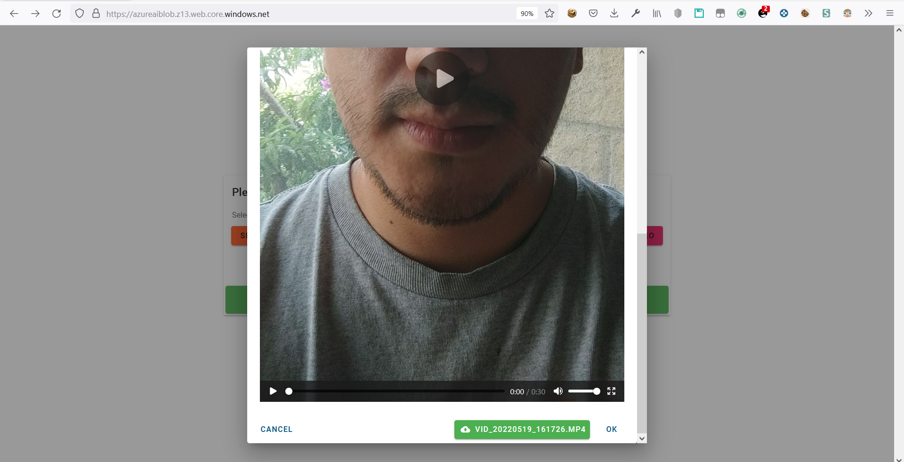

### Step 3: Face Data Extraction

#### :ballot_box_with_check: Python code snippet (either in text format or screenshot) showing you uploading the 30-second video from your local source or machine to Azure Video Analyzer
This part of the validation process is a little bit complex, as the solution consists of a web app simulating the boarding kiosk. So the first step is to upload the validation video to Azure Video Indexer, this video will be submitted by the user through the kiosk website, then, the Flask backend will upload it to Video Indexer using the unofficial python video indexer package.

After the video gets uploaded and analyzed, the video id is retrieved, this id is then used to get the generated thumbnail data and perform the facial validation.

This code snippet shows a Flask `POST` route that performs the video uploading to Azure Video Indexer, the video file is part of the request body

File: `app.py` at line `77`
```python
@app.route('/upload-video', methods=['POST'])
def upload_video():
    video = request.files['video']
    video_bytes = video.stream.read()

    if video and video_bytes:
        video_upload_id = video_indexer_client.upload_stream_to_video_indexer(
            video_bytes, video_name=(video.filename or '') + str(datetime.now()))
        info = video_indexer_client.get_video_info(video_upload_id)

        # Already a dict
        return info
```

Then, in another route, the validation process is performed using the video id generated for the video

File: `app.py` at line `134`
```python
# Performs full validation process taking ID card, video id (from previously uploaded video), boarding pass file and luggage image file
@app.route('/validate', methods=['POST'])
def validate_boarding():
    boarding_pass_file = request.files.get('boarding_pass')
    identity_doc_file = request.files.get('id_document')
    luggage_image_file = request.files.get('luggage')

    video_id = request.args.get('video_id')

    if not (boarding_pass_file and identity_doc_file):
        return {'error': 'You are missing required files'}, 400

    return validation_service.validate_boarding(boarding_pass_file=boarding_pass_file.stream,
                                                identity_doc_file=identity_doc_file.stream,
                                                luggage_image_file=luggage_image_file.stream if luggage_image_file else None,
                                                video_id=video_id, flight_manifest_service=flight_manifest_service)

```

This image shows the process of uploading the video from the kiosk website


As the process of uploading and analyzing the video file may take some time, the user is shown a progress bar indicating that the video is being uploaded.


Is after the video is uploaded and analyzed that the validation process begins


#### :ballot_box_with_check: Python code snippet (either in text format or screenshot) showing face thumbnail extracted from Azure Video Analyzer service. :ballot_box_with_check: Python code snippet (either in text format or screenshot) showing Person model is created based on face frames collected from Video Analyzer
For this, I created a method that takes the list of faces ids, which were generated from the ID card, and the video id generated from uploading the validation video to Azure Video Indexer.

The video id is used to get the video analysis, which contains the thumbnails generated from the faces detected in the video. These thumbnail data is used to build a person model, which then is used to validate with the faces detected from the ID card

File: `services/face.py` at line `91`
```python
def build_person_group_from_streams(
        stream_images,
        person_group_id,
        person_group_name=None,
        person_group_person_name=None,
        client: FaceClient = face_client):

    if not person_group_name:
        person_group_name = person_group_id + '-person-group'

    if not person_group_person_name:
        person_group_person_name = person_group_name + str(uuid4())

    # Create new person group
    try:
        client.person_group.create(person_group_id, person_group_name)
    except APIErrorException as api_exception:
        # Return if person group is already created
        if api_exception.error.error.code == 'PersonGroupExists':
            return person_group_id
        else:
            raise api_exception

    face_person = client.person_group_person.create(
        person_group_id, person_group_person_name)

    for stream_image in stream_images:
        client.person_group_person.add_face_from_stream(
            person_group_id, face_person.person_id, stream_image)

    client.person_group.train(person_group_id)

    # Train the person group
    while (True):
        training_status = client.person_group.get_training_status(
            person_group_id)
        print("Training status: {}.".format(training_status.status))

        if (training_status.status is TrainingStatusType.succeeded):
            return person_group_id
        elif (training_status.status is TrainingStatusType.failed):
            client.person_group.delete(person_group_id=person_group_id)
            raise Exception(
                f'Training the person group with id {person_group_id} has failed.')
        sleep(5)

def identify_from_video_group(detected_faces_ids: list,
                              video_id: str,
                              face_client: FaceClient = face_client,
                              vi_client: VideoIndexer = video_indexer_service.video_indexer_client):
    video_analysis = video_indexer_service.get_video_analysis(
        video_id, vi_client)

    # List of thumbnail ids
    thumbnail_ids = video_analysis.get('thumbnails')

    # Get each thumbnail as stream
    thumbnail_image_streams = video_indexer_service.get_video_thumbnail_streams(
        video_id, thumbnail_ids, vi_client)

    # Create group person from thumbnails in video
    person_group_id = build_person_group_from_streams(
        thumbnail_image_streams, person_group_id=video_id + '_group_id')

    # Identify based on detected faces
    identification_result = identity_face_from_person_group(
        detected_faces_ids, person_group_id, face_client)

    return identification_result
```
#### :ballot_box_with_check: Python code snippet (either in text format or screenshot) showing emotion and sentiment collected from the Azure Video Analyzer service
File: `services/video_indexer.py` at line `17`
```python
def get_video_thumbnails(video_info_response) -> List[str]:
    return [thumbnail['id'] for thumbnail in video_info_response['videos'][0]['insights']['faces'][0]['thumbnails']]

def get_video_analysis(video_id: str, vi_client : VideoIndexer = video_indexer_client):
  info = vi_client.get_video_info(video_id)

  thumbnails_ids = get_video_thumbnails(info)
  sentiments = info['summarizedInsights']['sentiments']
  emotions = info['summarizedInsights']['emotions']

  return {'thumbnails': thumbnails_ids, 'sentiments': sentiments, 'emotions': emotions}
```

#### :ballot_box_with_check: Python code snippet (either in text format or screenshot) showing the face extraction code from digital ID as input data using Azure Face API
For this I created two methods, which generate a list of ids from the faces detected from a identification card. One method uses the url of an image, and the other uses the image file.

This list of ids is then used in [Section 1](#ballot_box_with_check-python-code-snippet-either-in-text-format-or-screenshot-showing-you-uploading-the-30-second-video-from-your-local-source-or-machine-to-azure-video-analyzer) to validate the faces from the id document with the faces from the verification video.

File: `services/face.py` at line `66`
```python
def detect_faces_ids_from_stream(stream_image, face_client: FaceClient = face_client):
    detected_faces = face_client.face.detect_with_stream(stream_image)
    return [detected_face.face_id for detected_face in detected_faces]


def detected_faces_ids_from_url(url: str, face_client: FaceClient = face_client):
    detected_faces = face_client.face.detect_with_url(url)
    return [detected_face.face_id for detected_face in detected_faces]
```
