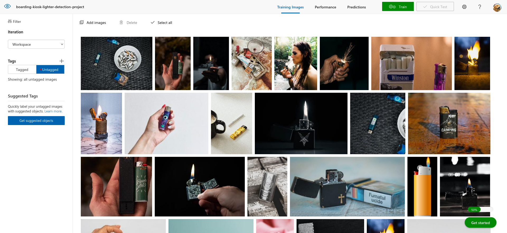
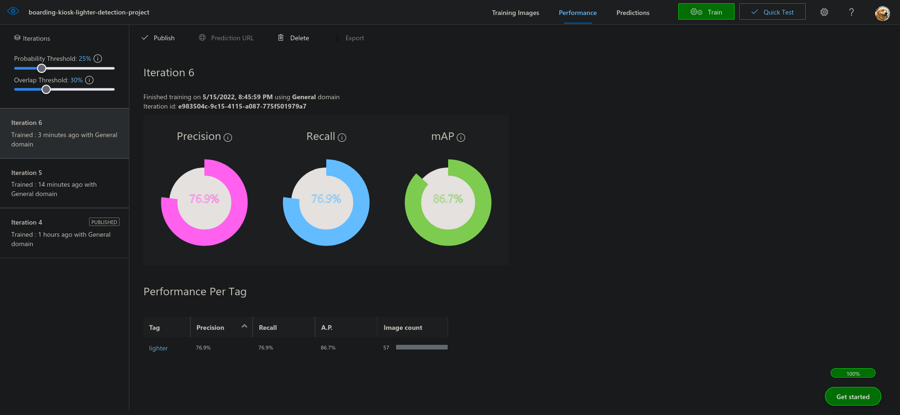
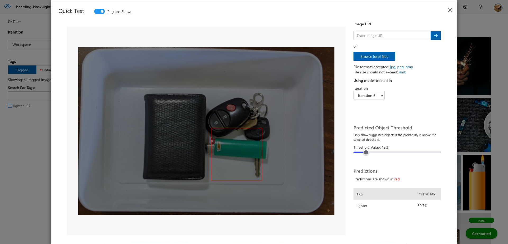

### Step 4: Object Detection

<h4 id="section-1">
:ballot_box_with_check: Screenshots from the https://customvision.ai website while performing image labeling in the object detection model training process
</h4>

For this I used a total of **55 ligther images**. After the labeling process I did a total of **6 iterations** achieving a Precision of 76.9%, Recall of 76.9% and mAP of 86.7%





#### :ballot_box_with_check: \[Optional\] Perform the training also from the Python API and share the Python code snippet (either in text format or screenshot) showing model training screenshot with training images with labels
For this I created two scripts. The first one is used to create the Custom Vision Project and add labels to it.

Data like Azure credentials (training key, prediction key), project name and custom labels are loaded from enviroment variables

The script is run executing `python -m scripts.object_detection.create_project` from the project's root folder

File: `scripts/object_detection/create_project.py`
```python
from azure.cognitiveservices.vision.customvision.training import CustomVisionTrainingClient
from azure.cognitiveservices.vision.customvision.prediction import CustomVisionPredictionClient
from msrest.authentication import ApiKeyCredentials

from env import ENV

custom_vision_config = ENV.azure.custom_vision

__training_credentials = ApiKeyCredentials(
    in_headers={"Training-key": custom_vision_config.training.key})
trainer = CustomVisionTrainingClient(
    custom_vision_config.training.endpoint, __training_credentials)

__prediction_credentials = ApiKeyCredentials(
    in_headers={"Prediction-key": custom_vision_config.prediction.key})
predictor = CustomVisionPredictionClient(
    custom_vision_config.prediction.endpoint, __prediction_credentials)

if __name__ == "__main__":
    # Find the object detection domain
    obj_detection_domain = next(domain for domain in trainer.get_domains(
    ) if domain.type == "ObjectDetection" and domain.name == "General")

    # Create a new project
    print("Your Object Detection Training project has been created. Please move on.")
    project_name = custom_vision_config.custom_project.name
    project = trainer.create_project(
        project_name, domain_id=obj_detection_domain.id)

    # Show project info
    print('Project info:')
    print(project.as_dict())
    print(f'\nProject status: {project.status}')

    # Add project tags
    print('\nAdding tags to project')
    project_tags = custom_vision_config.custom_project.tags
    for tag in project_tags:
        print(
            f'Adding tag: "{tag}" to project: {project_name}, id:{project.id}')
        trainer.create_tag(project.id, tag)

```


After this script is executed, the project is created at the Custom Vision website to start uploading images, labeling and training, as shown in [the first part](#user-content-section-1)

<span id="train-and-publish"></span>

The second script is used to train the model, it generates a new iteration and publishes it, with the iteration id as output

The script is run executing `python -m scripts.object_detection.train_model` from the project's root folder

File: `scripts/object_detection/train_model.py`
```python
from time import sleep
from uuid import uuid4
from datetime import datetime
from .create_project import trainer, custom_vision_config

custom_project_id = custom_vision_config.custom_project.project_id
custom_project_name = custom_vision_config.custom_project.name

# Training the project
SLEEP_TIME = 30
print(f'Started project training for project {custom_project_name}, id: {custom_project_id}')

# Show time training started
training_started_at = datetime.now()
print(f"Training started: {training_started_at.strftime('%A, %B the %dth, %Y at %H:%M:%S ')}")

iteration = trainer.train_project(custom_project_id)

while (iteration.status != "Completed"):
    iteration = trainer.get_iteration(custom_project_id, iteration.id)
    print ("Training status: " + iteration.status)
    print (f"Waiting {SLEEP_TIME} seconds...")
    sleep(SLEEP_TIME)

training_finished_at = datetime.now()
print(f"Training finished: {training_finished_at.strftime('%A, %B the %dth, %Y at %H:%M:%S ')}")

# Show info about iterations
print(f'Iterations in project {custom_project_name}, id: {custom_project_id}')
iteration_list = trainer.get_iterations(custom_project_id)
for iteration_item in iteration_list:
    print(iteration_item)

# Show model performance statistics
print(f'Performance for iteration {iteration_list[0].id}')
model_perf = trainer.get_iteration_performance(custom_project_id, iteration_list[0].id)
print(model_perf.as_dict())

publish_iteration_name = custom_project_name + '-' + iteration_list[0].name

# # The iteration is now trained. Publish it to the project endpoint
print(f'Publishing iteration "{publish_iteration_name}" to project {custom_project_name}')
trainer.publish_iteration(custom_project_id, iteration.id, publish_iteration_name, custom_vision_config.prediction.resource_id)
print ("Done!")
```


#### :ballot_box_with_check: Screenshots from the https://customvision.ai website while performing the training process of the object detection model


#### :ballot_box_with_check: Screenshots from the https://customvision.ai website while performing the validation process in the object detection model training process


#### :ballot_box_with_check: Screenshot showing the precision and recall values of the custom object detection model


#### :ballot_box_with_check: Python code snippet (either in text format or screenshot) showing model is deployed to an endpoint, and the endpoint URL is shared
[Here](#user-content-train-and-publish)

#### :ballot_box_with_check: Python code snippet (either in text format or screenshot) showing how your custom model is used for prediction using your own endpoint URL
This method is used to validate the luggage image uploaded by the user from the kiosk website

File: `services/validation.py` at line `124`
```python
def validate_luggage(luggage_image_file, flight_manifest_row, flight_manifest_service: FlightManifest = flight_manifest_service):
    predictions = custom_vision_service.detect_with_stream(luggage_image_file)

    if len(predictions) > 0:
        # Lighter has been detected
        return False, 'A lighter has been detected', None

    # Update flight manifest
    flight_manifest_row['LuggageValidation'] = str(True).upper()
    flight_manifest_service.upload()

    return True, {}, flight_manifest_row
```

Which uses another method that detects objects in the image and filters the results based on a set threshold. The threshold value and credentials (like prediction endpoint and key, iteration id, etc) are loaded from enviroment variables

File: `services/custom_vision.py` at line `17`
```python
def detect_with_stream(stream_image, threshold=prediction_threshold, predictor: CustomVisionPredictionClient = predictor):
    # Detect objects using custom trained model
    results = predictor.detect_image(project_id=custom_project_config.project_id,
                                     published_name=custom_project_config.iteration_name, image_data=stream_image)

    return __filter_predictions(results.predictions, threshold)

```

#### :ballot_box_with_check: Screenshots displaying lighter detection probability using the custom object detection model for every one of the 5 provided test images



